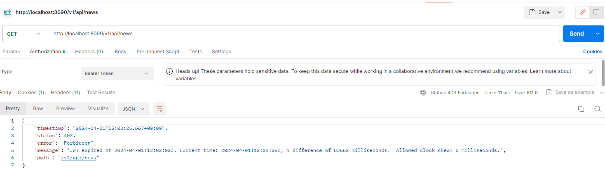
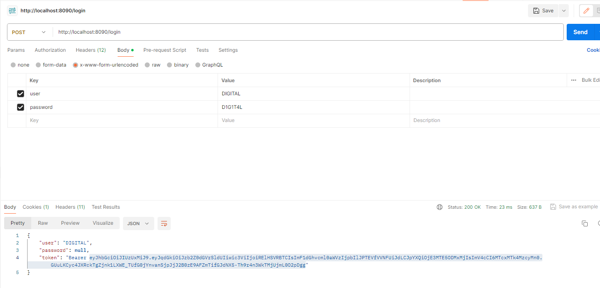
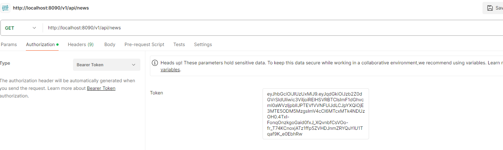
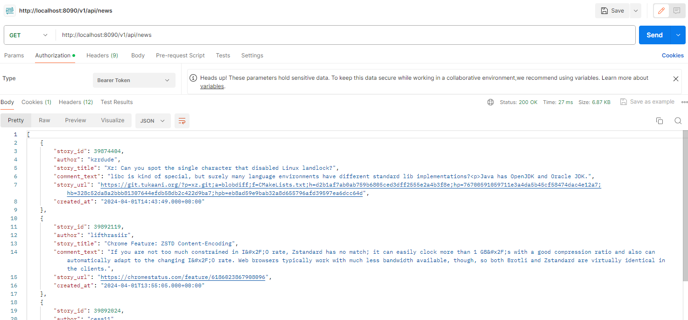
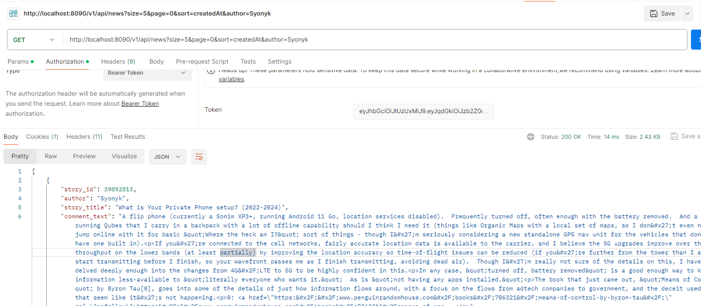
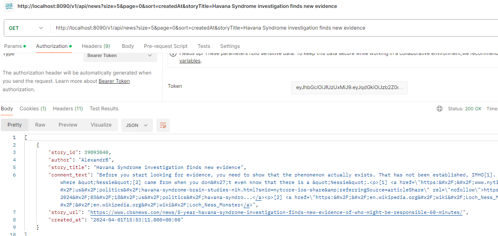

# API DIGITAL 
#### API to get news from external API, this API is executed every 1 hour and then if the Story_id doesn't exist in BD News add the new story, if already exist don't register again

### STACK

- SpringBoot 2.5.6
- Java 1.8
- Postgresql 12
- JPA
- JWT

### First step
- To run the app you need create a BD call: news
- Please replace {BD_NAME} {USER} {PASS}
- Every 1-hour call the external api with this configuration
- news.check.scheduler = 0 0 */1 * * *
- The first call to the external API will be when the APP IS RUN

### CALL API WITHOUT JWT
- If you try to call the api without the token the response looks like this:

### JWT
- To get a new token you need to send a new post whit user and password:
http://localhost:8090/login
- For this example I declareted the user and password in the application properties, so when you send the credencials in the api login, this credencials should be the same security.api.user = DIGITAL security.api.password = D1G1T4L

### Consume API NEWS WITH TOKEN
- You need to copy the token and paste in the authorization section with Bearer Token:

- And then you can call the api news:
http://localhost:8090/v1/api/news

#### Consume API NEWS with filters
- You can apply filter when you call the api
get all news:
http://localhost:8090/v1/api/news

get just 1 news on the page 0
http://localhost:8090/v1/api/news?size=1&page=0

get just 5 on the page 0 order by createdAt
http://localhost:8090/v1/api/news?size=5&page=0&sort=createdAt

By author call Syonyk
http://localhost:8090/v1/api/news?size=5&page=0&sort=createdAt&author=Syonyk

By story title
http://localhost:8090/v1/api/news?size=5&page=0&sort=createdAt&storyTitle=Havana Syndrome investigation finds new evidence

#### To generate a package
- mvn clean package
- and will generate challenge-0.0.1.jar

### OBS: Every called to the api return a maximum 5 register, the maximum is configured in the application properties news.pageSize = 5

### The documentation is in:
http://localhost:8090/swagger-ui/

